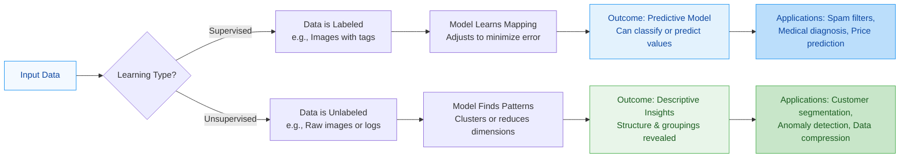

**Unsupervised Learning** is a branch of machine learning where the model learns from **unlabeled data**.
- **No Labels:** The input data consists of features only, with no pre-defined target or output class (e.g., "cat" vs "dog").
- **Goal:** To model the underlying structure or distribution in the data to learn more about it.
- **Self-Discovery:** The algorithm finds similarities or differences in the data without any explicit guidance.

### Key Tasks in Unsupervised Learning
There are three main types of tasks:
#### 1. [[Clustering]]
The process of grouping a set of objects such that objects in the same group (called a **cluster**) are more similar to each other than to those in other groups.
- **Algorithms:** K-means, Hierarchical Clustering (Agglomerative/Divisive), DBSCAN.
- **Example:** A bank grouping its customers based on spending habits for targeted marketing.
#### 2. Association Rule Learning
Finding interesting relationships or "rules" that describe your data.
- **Algorithms:** Apriori, FP-Growth.
- **Example:** "If a customer buys bread and butter, they are 80% likely to also buy milk." (Market Basket Analysis).
#### 3. Dimensionality Reduction
Reducing the number of random variables under consideration by obtaining a set of principal variables.
- **Algorithms:** Principal Component Analysis (PCA), Singular Value Decomposition (SVD).
- **Example:** Taking a dataset with 100 different features of a house and condensing them into the 3 most important factors to simplify the model.

| **Feature**    | **Supervised Learning**                 | **Unsupervised Learning**                         |
| -------------- | --------------------------------------- | ------------------------------------------------- |
| **Data**       | Labeled (Input + Correct Answer)        | Unlabeled (Input only)                            |
| **Goal**       | Predict a target class or value         | Discover hidden patterns/structure                |
| **Feedback**   | Clear "Right/Wrong" (Error rate)        | No objective "Right" answer (Internal evaluation) |
| **Complexity** | Simple logic, but needs manual labeling | More complex and computationally heavy            |
| **Result**     | Highly accurate predictions             | Descriptive insights (interpretation required)    |
| **Tasks**      | Classification, Regression              | Clustering, Association, Dimensionality Reduction |
### Real-World Applications
- **Customer Segmentation:** Grouping shoppers by behavior to personalize ads.
- **Anomaly Detection:** Identifying "odd" credit card transactions to detect fraud.
- **Social Network Analysis:** Finding communities or "clusters" of friends on platforms like Facebook or LinkedIn.
- **Medical Imaging:** Segmenting different types of tissues in an MRI scan without knowing what they are beforehand.

