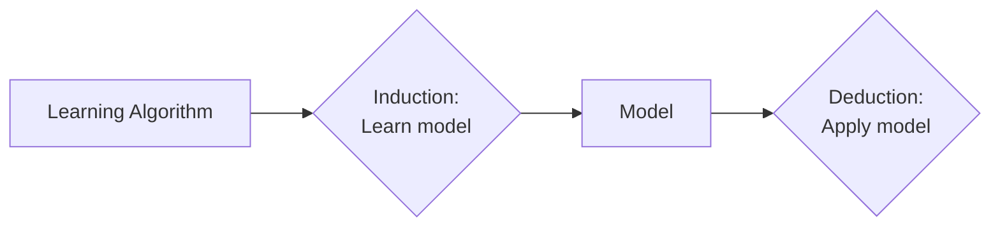

Classification is a supervised learning approach used to classify data points into known classes.
- A learning algorithm is trained on *labelled* data.
- Learning algorithm tries to catch the underlying relationships in attributes that helps determine the class

Task: To predict what class a given data point lies in, i.e the model maps each data point to a class
Data: Labelled data. Data has a set of attributes(X) and a class label (y)

## Classification Techniques
Base classifiers - Basic learning algorithm
1. [[Decision Trees]]
2. Rule-based methods
3. [[K Nearest Neighbhours]]
4. [[Logistic Regression]]
5. [[Naive Bayes Classifier]] and Bayesian Belief Networks
6. Support Vector Machines
7. Neural Networks

[[Ensemble Techniques]] - A combination of base classifiers
