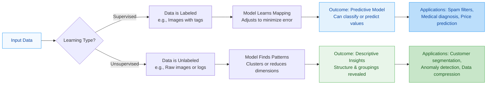

**Supervised Learning** is a branch of machine learning where the model learns from **labeled data**.

-   **Labels Provided:** The input data comes with the correct "answer" or target variable (e.g., an image labeled "cat").
-   **Goal:** To learn a **mapping function** that relates input features to the correct output, enabling the model to make accurate predictions on new, unseen data.
-   **Guided Learning:** The algorithm is explicitly guided during training. It makes a prediction, is shown the actual answer, and adjusts its internal parameters to reduce the error.

### Key Tasks in Supervised Learning
There are two main types of tasks:

#### 1. [[Classification]]
Predicting a **discrete label or category** for a given input.
-   **Output:** A class or category (e.g., "Spam" or "Not Spam").
-   **Algorithms:** Logistic Regression, Decision Trees, Random Forest, Support Vector Machines (SVM), Neural Networks.
-   **Example:** An email filter classifying incoming messages as "Spam" or "Not Spam."

#### 2. Regression
Predicting a **continuous numerical value** for a given input.
-   **Output:** A real number (e.g., 250.5, 42, -1.8).
-   **Algorithms:** Linear Regression, Ridge/Lasso Regression, Support Vector Regression (SVR), Neural Networks.
-   **Example:** Predicting the exact price of a house based on its size, location, and number of bedrooms.

| Feature       | **Supervised Learning**                  | **Unsupervised Learning**                        |
|---------------|------------------------------------------|--------------------------------------------------|
| **Data**      | Labeled (Input + Correct Answer)         | Unlabeled (Input only)                           |
| **Goal**      | Predict a target class or value          | Discover hidden patterns/structure               |
| **Feedback**  | Clear "Right/Wrong" (Error rate)         |范式 No objective "Right" answer (Internal evaluation) |
| **Complexity**| Simple logic, but needs manual labeling  | More complex and computationally heavy           |
| **Result**    | Highly accurate predictions              | Descriptive insights (interpretation required)  |
| **Tasks**     | Classification, Regression               | Clustering, Association, Dimensionality Reduction |

### Real-World Applications
-   **Image & Speech Recognition:** Identifying objects in photos or converting spoken words into text (e.g., Google Photos, Siri).
-   **Medical Diagnosis:** Predicting whether a tumor is **benign** or **malignant** based on patient data and medical images.
-   **Financial Forecasting:** Predicting **stock prices** or **credit scores** based on historical market data.
-   **Spam Detection:** Classifying emails as "Spam" or "Not Spam" based on their content and sender.
-   **Recommendation Systems:** Predicting a user's rating for a movie or product they haven't seen yet (e.g., Netflix, Amazon).

### Summary Comparison: Supervised vs. Unsupervised Learning

| **Aspect**          | **Supervised Learning**                                                                 | **Unsupervised Learning**                                                        |
| ------------------- | -------------------------------------------------------------------------------------- | -------------------------------------------------------------------------------- |
| **Core Concept**    | Learning with a "teacher" (labeled data)                                               | Learning by self-discovery (unlabeled data)                                      |
| **Primary Objective** | **Prediction:** Making accurate forecasts on new data.                               | **Discovery:** Uncovering hidden patterns, structures, or groupings in the data. |
| **Main Tasks**      | Classification (Categorical) and Regression (Continuous)                             | Clustering, Association, Dimensionality Reduction                               |
| **Human Effort**    | High (requires labeling data, which is time-consuming and expensive)                 | Low (no labels needed, but interpreting results can be complex)                 |
| **Use When...**     | You have historical data with known outcomes and want to predict future outcomes.    | You have data without clear outcomes and want to explore its underlying structure. |
| **Evaluation**      | Straightforward: Compare predictions to actual labels (Accuracy, MSE, etc.).         | Challenging: Requires internal metrics (e.g., silhouette score) or human judgment. |
| **Example**         | Predicting house prices based on features like size and location.                    | Grouping customers with similar purchasing behaviors without predefined segments. |

