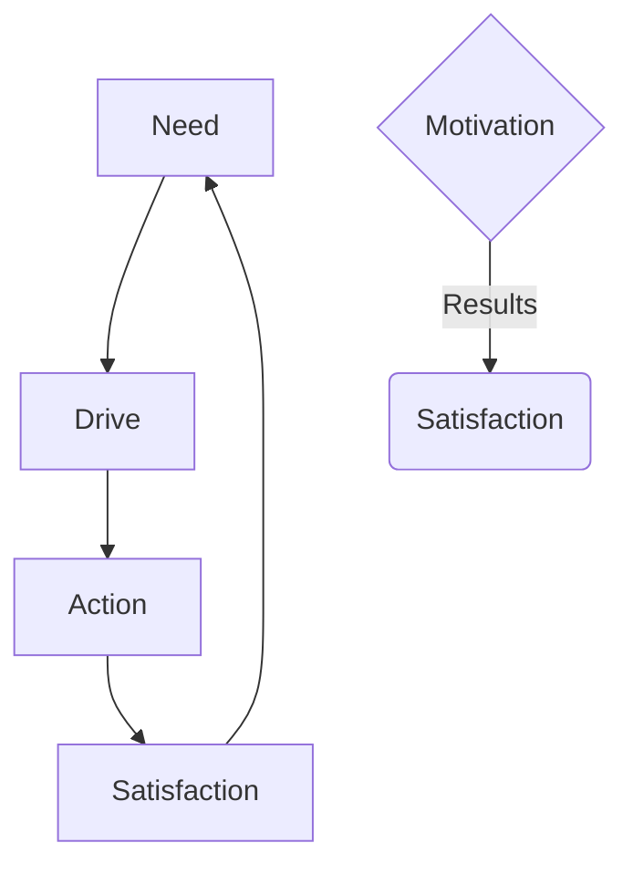

Motivation : Willingness to do work

Motivation -> Performance -> Satisfaction

Component of motivation: Need, Drive, Action/Incentive (helps decrease need and drive by giving satisfaction)

Model of motivation: Stimulus -> Response -> Outcome

Individuals differ in motivation
Individuals may not be aware of their motivation
Motivation is expressed differently

$$
\text{Job Performance} = f(\text{ability}*\text{motivation}*\text{support})
$$

Content theories -> explain why people have needs
Process theories -> explain how needs are translated to behaviour

Content theory
1. Maslows Hierarchy of needs
2. Alderfer's ERG theory
3. Herzberg's theory
4. McClelland's Learned Needs
![[Pasted image 20251223130236.png]]

# Maslows Hierarchy of Needs
![[Pasted image 20260105101615.png]]

# Herzberg's two factor theory
Hygiene factors -> dissatisfier. basic needs. if hygiene factors decrease employee is dissatisfied. but if it increases there is not much increase in satisfaction

Motivator factors -> satisfier. needed for motivation. if this increases more satisfaction in job

![[Pasted image 20260105102442.png]]

# McGregor theory X and theory Y
![[Pasted image 20260105102915.png]]

# ERG Theory
![[Pasted image 20260105102947.png]]
similar to maslows theory

key differences

# McClellands three needs theory
- achievement
- affiliation
- power

# Adams Equity Theory

# Vrooms Expectancy theory
high motivation = high expectancy x high instrumentality x high valence

expectancy : effort to performance
instrumentality : performance to outcome
valence : outcome to value

---

The main points of the document, which discusses **Motivation Process & Theories**, are as follows:

  

**1. Meaning of Motivation**

- Motivation describes instinctive and rational processes that help people satisfy basic drives, perceived needs, and personal goals.
- It is a process and a drive, defined as the keenness for a behavior or willingness to work toward a specific reward or goal.
- It arises from internal forces within a person, such as needs, drives, or motives.

**2. The Motivation Process/Components**

- Motivation starts with a physiological or psychological deficiency or need that activates a drive, leading to behavior directed toward a goal.
- **Need:** Created by physiological or psychological imbalance.
- **Drive:** The deficiency that gives direction and energy.
- **Incentive:** Anything that alleviates the need and reduces the drive, restoring balance.
- A Model of Motivation is shown as: Stimulus (Need/Drive) → Response (Behavior) → Outcome (Satisfaction/Frustration).

**3. Classification of Needs (Schein's Classification)**

- **Rational-Economic Model:** People are motivated by self-interest and maximizing gains (e.g., earning more money).
- **Social Model:** People are motivated by the need for relationships and belonging (e.g., thriving in a supportive group).
- **Self-Actualization Model:** People are motivated by challenges, responsibility, and autonomy (e.g., leading a challenging project).
- **Complex Model:** Motivation involves many interrelated factors, requiring different motivational approaches for individuals.

**4. Classification of Motives**

- **Primary Motives:** Physiological/biological and unlearned (e.g., need for food, water, or sleep).
- **Secondary Motives:** Psychological and learned (e.g., need for recognition, belongingness, or power).

**5. Theories of Motivation**

- **Content Theories (1950-1960):** Focus on "what" motivates people (e.g., Maslow's, McGregor's, Herzberg's, Alderfer's theories).
- **Process Theories (1960s):** Focus on "how" motivation occurs (e.g., Vroom's Expectancy Theory, Porter Lawler Model).
- **Contemporary Theories (1961):** Reflect modern approaches (e.g., McClelland's, Stacy Adams' theories).

**6. McClelland's Motivation Model (Contemporary Theory)**

- **Need for Achievement (n-Ach):** Desire to be competitive, goal-driven, and innovative; moderate risk-takers who need immediate feedback.
- **Need for Power (n-Pow):** Desire to influence, control others, and gain authority.
- **Need for Affiliation (n-Aff):** Desire for social interaction, belonging, and harmony.

**7. Maslow's Hierarchy of Needs Theory (Content Theory)**

- Motivation is arranged in a hierarchy; once a lower-level need is satisfied, the next higher-level need becomes the motivator.
- **Five Levels:**
    1. **Basic or Physiological Needs:** Survival needs (food, water, air, shelter); met by fair wages, safe conditions.
    2. **Safety or Security Needs:** Stable, threat-free environment (physical and economic safety); met by job security, health insurance, safety training.
    3. **Social Needs:** Need to belong, be accepted, and receive affection; met by encouraging teamwork and social interactions.
    4. **Ego or Esteem Needs:** Self-esteem (competence) and recognition (status); met by promotions, bonuses, titles, and responsibility.
    5. **Self-Actualization Needs:** Need to realize full potential, self-development, and creativity; met by challenging work, innovation, and autonomy.

**8. Douglas McGregor's Theory X and Theory Y (Content Theory)**

- **Theory X (Pessimistic View):** Assumes employees dislike work, are lazy, need coercion/control, avoid responsibility, and lack ambition.
- **Theory Y (Optimistic View):** Assumes employees view work as natural, are self-motivated, willingly seek responsibility, and are creative/innovative.
- **Real-Life Application:** Effective management often requires a blend of both approaches.

**9. Herzberg's Two-Factor Theory (Content Theory)**

- Identified two sets of factors influencing job attitudes:
    - **Motivators (Satisfiers):** Related to job content and are intrinsic; lead to job satisfaction and commitment (e.g., Achievement, Recognition, The Work Itself, Responsibility, Advancement and Growth).
    - **Hygiene Factors (Dissatisfiers):** Related to job context and are extrinsic; prevent dissatisfaction but do not cause satisfaction (e.g., Company Policy, Supervision, Salary, Interpersonal Relationships, Working Conditions).
- **Key Conclusion:** Satisfaction is driven by motivators, while dissatisfaction is caused by hygiene factors.

**10. Alderfer's ERG Theory (Content Theory)**

- Categorizes needs into three groups: **Existence, Relatedness, and Growth**.
- **Existence Needs:** Basic survival and physiological well-being (food, water, shelter, safety).
- **Relatedness Needs:** Interpersonal and social relationships, belonging, and acceptance.
- **Growth Needs:** Intrinsic desire for personal and professional development.
- **Key Difference from Maslow:** There is **no strict hierarchy**. It includes a **Frustration-Regression Relationship**, where an inability to satisfy higher-order needs leads to a focus on lower-order needs.

**11. Vroom's Expectancy Theory (Process Theory)**

- Explains motivation based on anticipated rewards; people make rational decisions based on their subjective perception of reality.
- **Motivation Force (F) = Valence × Expectancy × Instrumentality**.
    - **Expectancy:** Belief that effort will lead to good performance.
    - **Instrumentality:** Belief that good performance will result in desired rewards.
    - **Valence:** The value or attractiveness of the reward to the individual.

**12. Porter-Lawler Model (Process Theory)**

- Refines Vroom's theory by showing that effort does not always equal performance (Performance is influenced by ability and role perception).
- It also states that performance may or may not lead to rewards, which are classified as intrinsic or extrinsic.
- **Satisfaction** is determined by the perception of whether the rewards are fair and equitable.
- Includes **Feedback Loops** where satisfaction or dissatisfaction with past rewards influences future effort.

**13. Equity Theory (Contemporary Theory)**

- Developed by Stacy Adams, it explains how perceptions of **fairness and equity** influence motivation.
- Employees compare their **Outcomes/Inputs ratio** to a **comparable other**.
    - **Equity:** Ratios are equal, leading to satisfaction.
    - **Inequity:** Ratios are unequal, creating psychological tension (e.g., feeling under- or overcompensated).
- **Response to Inequity:** Employees take action to restore fairness, such as changing their inputs (reducing effort), changing their outcomes (asking for a raise), or changing their perception.
- Identifies two types of justice: **Distributive Justice** (fairness of the reward amount) and **Procedural Justice** (fairness of the process used to allocate rewards).