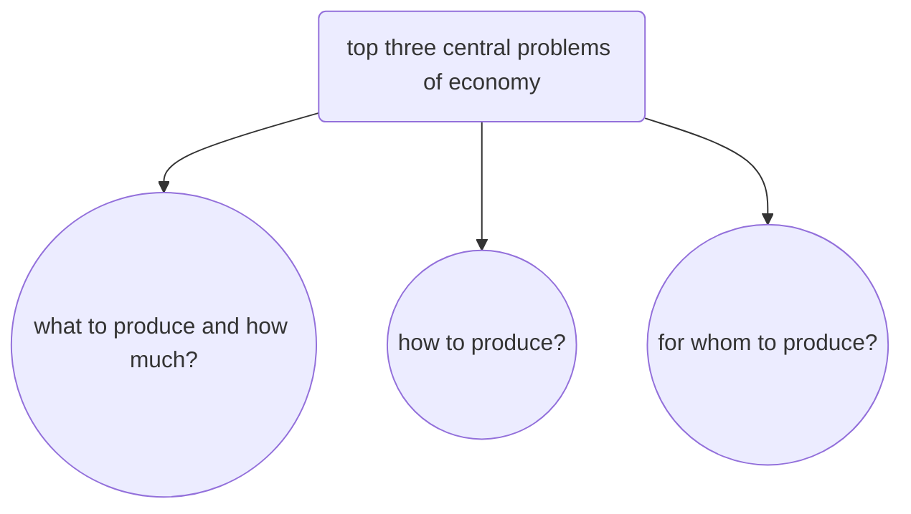

Reasons for economic problem
1. scarcity of resources - resources are limited and cant meet everyones wants
2. unlimited human wants
3. alternative uses - resources can be put to many different uses

| Basis          | Microeconomics                                           | Macroeconomics                           |
| -------------- | -------------------------------------------------------- | ---------------------------------------- |
| Meaning        | Behaviour of individual economic units                   | Study of economy as a whole              |
| Tools          | Demand and Supply                                        | Aggregate demand and aggregate supply    |
| Objective      | To determine price of commodity or factors of production | To determine income and employment level |
| Alternate name | Price Theory                                             | Income and employment theory             |
| Example        | Individual income and output                             | National income, national output         |
| Aggregation    | Limited  degree of aggregation                           | Highest degree of aggregation            |

Microeconomics:
1. theory of product prizing
	1. theory of consumer behaviour
	2. theory of production and cost
2. theory of factor prizing
	1. theory of wages
	2. theory of rent
	3. theory of interest
	4. theory of profits
3. theory of economic welfare

| Difference      | Positive economics                    | Normative economoics             |
| --------------- | ------------------------------------- | -------------------------------- |
| Meaning         | deals with things as they are         | things as they should be         |
| Basis           | based on real facts                   | individual opinons               |
| Verification    | verified with actual data             | cannot be verified               |
| Nature          | pure and netral between ends          | suggestive and optimum in nature |
| Purpose         | real description of economic activity | determine ideals                 |
| Value judgement | no value judgement                    | valued judgement is crucial      |

How to produce -> selection of technique
for whom to produce -> selection of category of people

Opportunity cost -> cost of next best alternative foregone due to a choice

